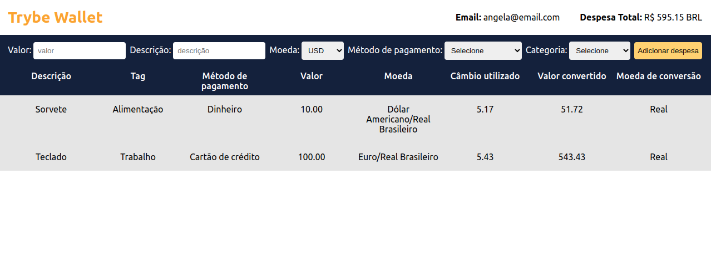

# Projeto Trybe Wallet

Projeto desenvolvido durante o curso da Trybe para fixação de aprendizados utilizando o Redux como ferramenta de manipulação de estado no React.

### Desenvolvimento

Os objetivos desse projeto foi desenvolver uma aplicação que simula uma carteira virtual com conversor de moedas, em que o usuário será capaz de:

* Adicionar um gasto contendo o valor, categoria, descrição e a conversão desse valor;
* Visualizar a tabela com os gastos;
* Visualizar o total de gastos convertidos para uma moeda de sua escolha;

### Habilidades

* Criar um store Redux em uma aplicação React;
* Criar reducers;
* Criar actions;
* Criar dispatchers;
* Conectar o Redux aos componentes React;

